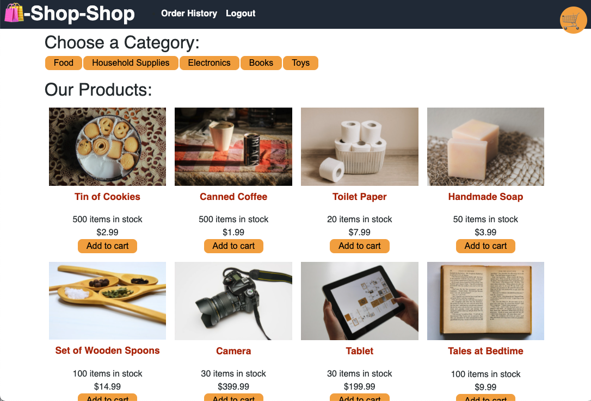

# Shop Shop

## Description

Shop Shop is a refactored Redux e-commerce site where users can create accounts and make purchases. Built with React, Redux and Apollo GraphQL.

---

## Table of Contents

- [Website](#website)
- [Built With](#built-with)
- [Usage](#usage)
- [Acknowledgements](#acknowledgements)

---

## Website

https://morning-bayou-51649.herokuapp.com/

---

## Built With

[Back to Contents](#table-of-contents)

---

## Usage

Clone project and from command line run npm install, npm run seed:prod, then npm start. Use the website link above to check out the site.

[Back to Contents](#table-of-contents)

---

### Michael Spore

- Converted this app from React to Redux.

[Spody10](https://github.com/Spody10)

---

[Back to Contents](#table-of-contents)
